HTML Foundations: your first web page
-------------------------------------

Coding up your first web page is a straightforward process, and we can
get this done in less than 15 lines of HTML code. The following is all
you need to construct your first web page using HTML. This might look a
little different to anything you've seen before, but we'll go through
each line in detail.

   
```html
*\<**!DOCTYPE html**\> *

*\<**html** lang=\"en\"\> \
\<**head**\> *

*\<**meta** charset=\"utf-8\" /\> *

*\<**title**\>My First Web Page\</**title**\> *

*\</**head**\> \
\<**body**\> *

*\<**h1**\>Hello World\</**h1**\> *

*\<**p**\>My first web page.\</**p**\> *

*\</**body**\> \
\</**html**\>*
```

The first line *\<**!DOCTYPE html**\>* informs the browser
about the type of HTML version that is being used and is called the
document type declaration. This simple statement means that HTML5 is the
version of the markup that will be used for the rest of this
document. The document declaration is always placed at the beginning of
the file before writing any HTML markup. 

HTML Tag
--------

The next piece of HTML code is the *\<**html** lang=\"en\"\> *and
this signifies the beginning of the document. As you will soon see, most
elements come in pairs.

The *\<**html**\>* element comes in a pair and encapsulates all the
other elements. The pairs of elements have an opening, and this element
is closed right at the end of the document with *\</**html**\>*.  The
opening *\<**html**\>* element has an attribute that specifies the
language of the document; in our case we are setting the language as
English with *en*.

This is not something that you have to do to every single HTML document,
but it is one of those things that strictly specify which language will
be used. It's also useful for screen readers in terms of how they
enunciate the text, and is also very helpful for online translators,
so that they know which language they\'re dealing with.  You can find
all the ISO language codes here:
<http://www.html.am/reference/iso-language-codes.cfm>. 

 

**\
**

Head Tag
--------

The next element is the *\<**head**\>,* which is inside *\<**html**\>*.
This is a required tag that should only be used once on the web page.
The elements that reside inside the head tag aren't displayed on the web
pages and are hidden from visitors. 

Inside this element, you can place metadata -- this is accompanying
information about the page. In our web page, the *\<**meta**\>* element
has an attribute called charset that is set to utf-8. 

This simply specifies the character encoding for the HTML document. This
is something you should do for each of your HTML documents. You always
want to set the character encoding, and unless you\'re going to be using
Russian, Japanese, and the Persian alphabet, or other types of
characters, you\'re probably going to use utf-8. What this does is
inform the browser which encoding to use - that way, it\'s going to use
the proper characters when rendering content to the page. You also want
to set this encoding as the very first thing after the head tag,
so it\'s immediately set.

Meta tags don't actually do anything to the content that is presented in
the browser window, but they are used by the likes of search engines to
catalogue information about the web page. You will notice that the
*\<**meta**\>* tag doesn't have a corresponding closing tag. In HTML
there are some tags that are self-closing, and the *\<**meta**\>* tag is
one of them.

  

Title Tag
---------

The next element that sits inside *\<**head**\>* is
the *\<**title**\>.* This element sets the title of the document. The
text inside the pair of opening and closing tags of
the *\<**title**\>* element doesn't actually appear in the main body of
the document, instead the title appears in the tab or window of the
browser:

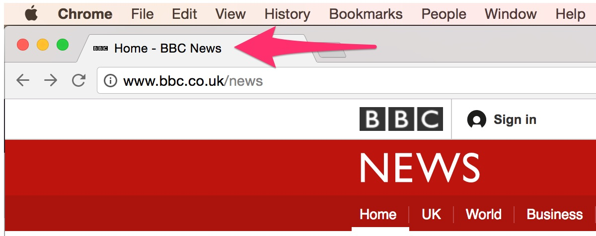{width="4.336872265966754in"
height="1.7457075678040246in"}

The closing tag for the *\</**head**\>* element comes after closing the
title tag, and this just closes the corresponding tag that was opened. 

Body Tag 
---------

The next element in the document is the *\<**body**\>* element, and
inside this tag is where the main content of the document will actually
be viewable to the user when the file is opened in a browser. Most of
the markup tags will actually go inside the ***body*** element. There
are two elements inside the main ***body*** element, ***h1,*** which
specifies the type of heading -- much like the heading 1 selection from
a Word document, and the ***p*** element that signifies the beginning of
a paragraph.

You could simply just write your text out inside the ***body*** element,
but to follow good semantics and to make it easier to style different
elements, it is best practice to wrap all paragraph text inside
a ***p*** element. Finally, the ***body*** and ***html*** elements are
closed off with closing tags.  

           

Save as a HTML document
-----------------------

Now that we have coded our first web page, we can save this as an HTML
file. First, make sure that you save the file with an appropriate name.
I'm saving mine as *first-web-page.html*. Please note it is important to
save your file with an **.***html* file extension, otherwise you won't
be able to open the file as a web page in your browser. Once you have
saved the file, just navigate to its location in your computer and
double click it to open -- it should open in your default browser:

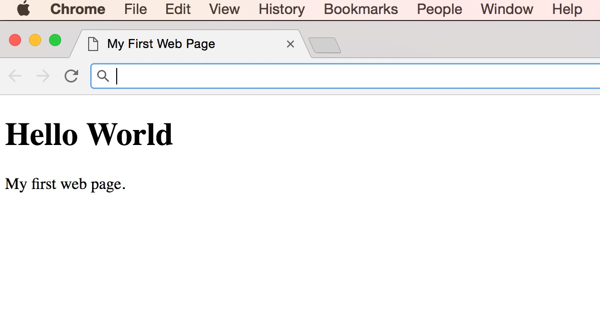{width="4.5in"
height="2.3215660542432195in"}

While it may not look exciting, you have just created your first web
page! HTML is the building blocks of all websites on the web, and
without HTML, there wouldn't be any websites.

**\
**

Comments in HTML
----------------

In HTML, and generally in software development, we have the ability to
leave comments within our code, and any content wrapped within a comment
will not be displayed on the web page. Comments play an important role
in helping us organize our code, allow us to convey our thinking and
reasoning behind what we have written to others, and provide a way for
us to more effectively manage our code. Comments become especially
useful when there are multiple people working on the same files. In
HTML, comments start with ***\<!\--*** and end with ***\--\>***. If you
create a new file in your chosen text editor and enter the following
markup:

*\<**!DOCTYPE html**\>*

*\<**html** lang=\"en\"\>*

*\<**head**\>*

*\<**meta** charset=\"utf-8\" /\>*

*\<**title**\>Comments in HTML\</**title**\>*

*\</**head**\>*

*\<**body**\>*

*\<!\-- this is a paragraph tag\--\>*

*\<**h1**\>Comments in HTML\</**h1**\>*

*\<**p**\>Comments are really useful in HTML web pages and also in
Software Development in general\</**p**\>*

*\</**body**\>*

*\</**html**\>*

Then save the file as *comments.html*. When you open the file in the
browser, you will see that we have a simple web page along with some
comments:

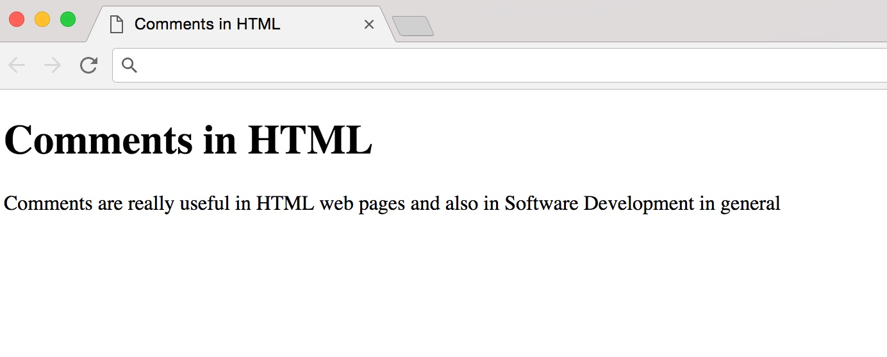{width="4.5in"
height="1.814096675415573in"}

As you can see, comments are ignored by the browser and not displayed to
the users. In most code editors, you can use a keyboard shortcut to add
comments into your code, simply highlight the text that you wish to turn
into a comment, on a Mac, simply hold down the command button and press
the forward slash key on your keyboard. For Windows, or Linux users,
hold down the Ctrl key and then press the forward slash key, and the
editor will automatically make the highlighted text a comment for you.
This works in Atom, Sublime, and pretty much most code editors.

**\
**

Headings 
---------

Just like in Word processed documents, headings play an important role
in the structure of your web page. Users can see what the headings are
for your document and can skim your pages according to its headings.
Search engines use the headings to index the structure of the web page.
In HTML, there are six levels of headings. The h1 heading should be used
for main headings, h2 is used for subheadings, and if there are further
sections under the subheadings, then you can use h3 up to h6. In your
code editor, type up the following and save as *headings.html*:

*\<**!DOCTYPE html**\> *

*\<**html** lang=\"en\"\> \
\<**head**\> *

*\<**meta** charset=\"utf-8\" /\>*

*\<**title**\>HTML Headings\</**title**\> *

*\</**head**\> \
\<**body**\> *

*\<**h1**\>Main Heading -- level 1\</**h1**\>*

*\<**h2**\>Subheading -- level 2\</**h2**\>*

*\<**h3**\>level 3 Heading\</**h3**\>*

*\<**h4**\>level 4 Heading\</**h4**\>*

*\<**h5**\>level 5 Heading\</**h5**\>*

*\<**h6**\>level 6 Heading\</**h6**\>   *

*\</**body**\> \
\</**html**\>*

Browsers will display the sizes of the headings slightly differently
from others. However, what you should see is that content of the h1
should be the largest of the six and as the level goes up, the size of
the contents should decrease in size:

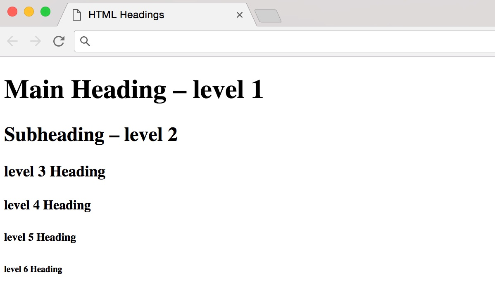{width="4.171692913385827in"
height="2.5in"}

 Paragraphs
----------

Paragraphs are one of the most basic tags that you will use in HTML. The
following is a simple HTML document that I've created with two
paragraphs. You can type up the following markup to get the same file,
and then save as *paragraphs.html*:

*\<**!DOCTYPE html**\> *

*\<**html** lang=\"en\"\> \
\<**head**\> *

*\<**meta** charset=\"utf-8\" /\>   *

*\<**title**\>Hello World\</**title**\> *

*\</**head**\> \
\<**body**\> *

*\<**h1**\>Understanding HTML\</**h1**\>*

*HTML is the building blocks of web pages*

*It specifies the structure of documents. *

> *HTML plays an important part in web documents along with Cascading
> Style Sheets. *

\*  *

*\</**body**\> \
\</**html**\>*

However, when you view this in the browser, it is formatted differently:

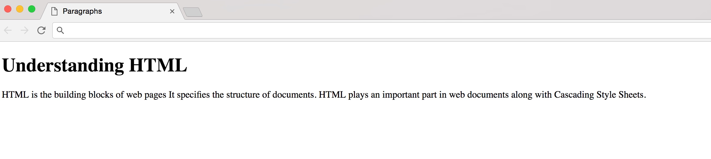{width="5.763888888888889in"
height="1.2944444444444445in"}

The browser has clumped together the two paragraphs into one, so the
visual structure that we see in the code is not what is reflected in the
output from the browser. For us to get the desired effect, we have to
tell the browser that each sentence is a single paragraph. We can do
that by wrapping each sentence with an opening and closing *\</**p**\>*
tag:

*\<**!DOCTYPE html**\> *

*\<**html** lang=\"en\"\> \
\<**head**\> *

*\<**meta** charset=\"utf-8\" /\> *

*\<**title**\>Hello World\</**title**\> *

*\</**head**\> \
\<**body**\> *

*\<**h1**\>Understanding HTML\</**h1**\>*

*\<**p**\>HTML is the building blocks of web pages*

*It specifies the structure of documents.\</**p**\> *

> *\<**p**\>HTML plays an important part in web documents along with
> Cascading Style Sheets.\</**p**\> *

\*  *

*\</**body**\> \
\</**html**\>*

Now when we save the document and reload the web page in the browser, we
get our desired effect:

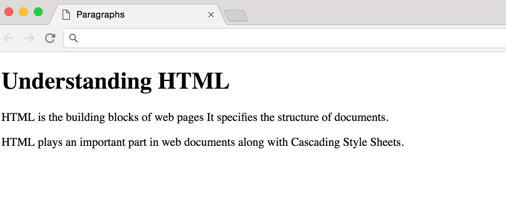{width="4.75in"
height="1.912590769903762in"}

We have the same code as before, but only this time we have wrapped our
sentences with the ***p*** tag. Pretty much all browsers will display
each paragraph on a new line with some space between it and any other
paragraphs that are on the page.

White Space 
------------

Web developers use white space liberally to help make the code easier to
read and understand. White space does not affect the rendering of web
pages in the browser. In fact, you can have as much space between
elements and content and the browser will ignore the extra spaces. Using
our paragraphs from the last example, we can add white space:

*\<**p**\>HTML is the building blocks of web pages*

*It specifies the structure of documents.\</**p**\> *

*\<p\>HTML plays an important part in web documents along with Cascading
Style Sheets .\</**p**\>*

Let's save this and refresh the browser to see if anything changed:

{width="4.656641513560805in"
height="1.875in"}

As you can see, this has no effect on the output. The browser has
collapsed all extra white space in the output. When the browser sees two
or more spaces next to each other, it will simply collapse the space
into just one space. You can also have a line break and the browser will
also treat that as a single space on output. This means that web
developers can make use of this to add indentations and extra white
space where necessary to make the code tidier and easier to comprehend.

Line Breaks & Horizontal rules 
-------------------------------

As we just saw, the browser will ignore any line breaks and collapse the
extra white space into a single one. However, what if you wanted a line
break within your paragraph? You can use the *\<**br**/\>* tag to
achieve this. Notice that the *\<**br**/\>* tag is self-closing just
like the meta tag we saw previously. Let's place a line break after the
first word in our first paragraph:

*\<**p**\>HTML \<**br** /\> is the building blocks of web pages*

*It specifies the structure of documents.\</**p**\>*

Save your changes and then refresh the browser to see the changes:

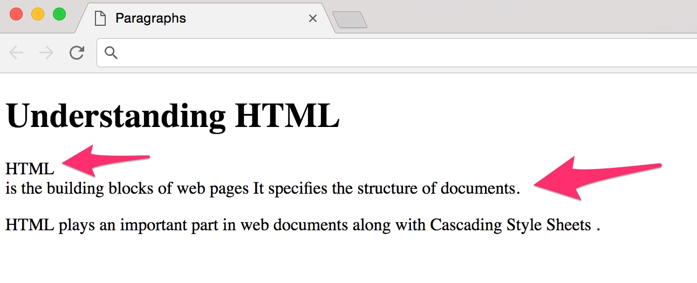{width="5.061264216972878in"
height="2.0604833770778654in"}

As you can see, the line break has been inserted exactly where we
specified in the HTML. The line break tag is useful when you want to add
a line break inside a paragraph.

Horizontal lines
----------------

Horizontal lines have been used as separation between items both in
print and on web documents. In HTML, you can use the *\<**hr /**\>* tag
to add a simple horizontal line in your web page. Let's add a line
between the two paragraphs that we currently have:

*\<**p**\>HTML is the building blocks of web pages*

*It specifies the structure of documents.\</**p**\> *

*\<**hr /**\>*

*\<**p**\>HTML plays an important part in web documents along with
Cascading Style Sheets.\</**p**\>*

Now, let's save this change in our text editor then switch over to the
browser and see the result:

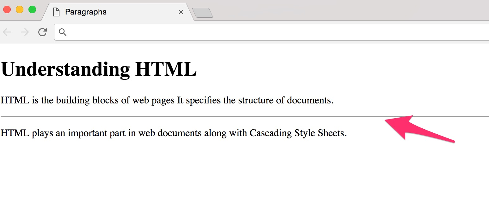{width="5.210725065616798in"
height="2.1169356955380576in"}

A solid horizontal line has now been added to the web page between the
two paragraphs. You can use this tag to separate different areas of the
page which can be useful in structuring your documents.

Emphasis & Strong Emphasis 
---------------------------

In writing, we generally emphasize certain words, sentence and headings
to make them stand out, or to help the reader to understand a point of
emphasis. You can do the same with web pages using four different tags:
bold, strong, italic and the emphasis tag.

I have created a page with four short paragraphs about the HTML tags
that are used to format text. Let's say that we want to make the words
*represents* and *emphasis* bold. We can achieve this using either bold
or strong, we will discuss the difference soon -- let's first make the
words bold using the *\<**b**\>* tag:

*\<**p**\>HTML is the building blocks of web pages*

*It specifies the structure of documents.\</**p**\> *

*\<**hr /**\>*

*\<**p**\>HTML plays an important part in web documents along with
Cascading Style Sheets.\</**p**\>*

*\<**h2**\>The Bold Tag\</**h2**\>*

> *\<**p**\>The bold tag (⟨b⟩) \<**b**\>represents\</**b**\> a span of
> text that you wish to highlight from the rest of the text without
> inferring any type of special relevance or meaning. As you would
> expect, browsers typically bold this text.\</**p**\>*

*\<**h2**\>The Strong Tag\</**h2**\>*

> *\<**p**\>By using the strong tag (⟨strong⟩)
> \<**b**\>represents\</**b**\> a string of text as having strong
> importance. The text should be considered to be more important than
> the text surrounding it. This is displayed as bold, just like the
> using the bold tag.\</**p**\>*

*\<**h2**\>The Italic Tag\</**h2**\>*

> *\<**p**\>Like the bold tag, the italic tag (⟨i⟩)
> \<**b**\>represents\</**b**\> a string of text that is highlighted
> from the text around it. No particular meaning is attached to the text
> when you use the (⟨i⟩) tag, it is just rendered in italics. Helpful
> for phrases, terms, or any text that is normally displayed in
> italics.\</**p**\>*

*\<**h2**\>The Emphasis Tag\</**h2**\>*

> *\<**p**\>The \<**b**\>emphasis\</**b**\> tag (⟨em⟩), or \"em\" tag,
> denotes text that is emphasized more than the text around it. Although
> this tag is usually rendered in italics, it shouldn\'t be used in
> place of the italics tag, rather it should be used for text that needs
> to be emphasized for some reason.\</**p**\>*

Save the changes and switch to your browser then refresh to see the
results:

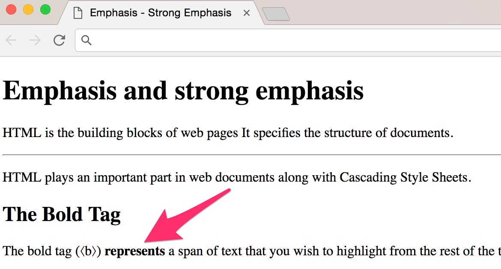{width="4.657688101487314in"
height="2.5in"}

The words *represent* and *emphasis* now stand out as bold. Adding the
bold tag has not added anything except the visual representation of the
bold text on the web page. We can achieve the same effect with the
strong tag by merely replacing it with the bold tag for each word
*\<**strong**\>represents\</**strong**\>* and
*\<**strong**\>emphasis\</**strong**\>.* We get exactly the same result
as before.

Try this out. You may be wondering: what is the difference between the
two tags? In terms of visual representation, there is no difference
whatsoever, they both highlight the text in question by making it bold.

However, there is a difference when it comes to semantic meaning. When
you use the bold tag, you are merely adding a visual stylistic element
to a piece of text and you are not inferring any type of special
relevance or meaning. You just want to make a piece of text bold.

However, when you use the strong tag, you are giving that piece of text
a semantic meaning, in other words these words in between the strong tag
have a strong importance. So, when a screen reader reads the text that
is in between a strong tag, if it is capable of doing a different vocal
inflection, it will know to emphasize that piece of text to get that
importance across to the listener.

The italic and emphasis tags both do the same thing. Let's italicize the
headings for each heading that describes the two tags using the
\<**i**\> and \<**em**\> tags respectively:

*\<**h2**\>\<**i**\>The Italic Tag\</**i**\>\</**h2**\>*

*\<**h2**\>\<**em**\>The Emphasis Tag\</**em**\>\</**h2**\>*

We need both an opening and closing tag for each of the tags to
italicize the words, so make sure to nest them inside the opening and
closing *\<**h2**\>* tags. Save and switch over to your browser, and you
will notice that both the headings are now italicized:

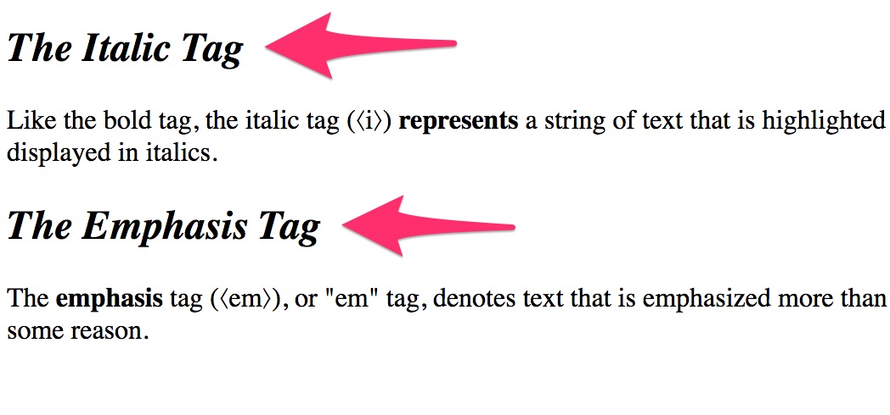{width="4.130648512685914in"
height="1.9314512248468942in"}

In the same way that adding a bold tag visually highlights a word,
adding an *\<**i**\>* just italicizes the word without adding any
semantic meaning. Using *\<**em**\>* on the other hand, adds semantic
meaning to your markup. It's telling screen readers, for example, that
this piece of text needs to be emphasized.

HTML Parent/Child Structure 
----------------------------

All HTML documents follow a structured parent child relationship. As
we've already created a web page, we did so by making sure the first
line in the document was the *\<**!DOCTYPE html**\>*, then the html
element then the head and so on. The following is a diagram of the
parent and child relationship of a simple web page:

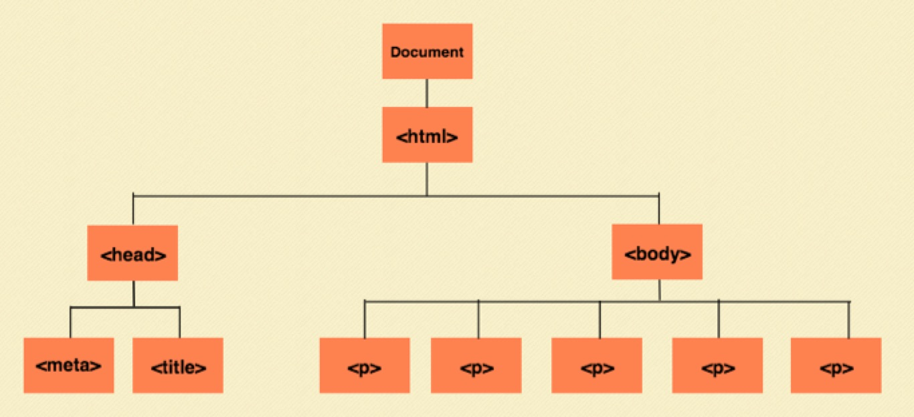{width="5.285592738407699in"
height="2.4148151793525807in"}

The very first element is the *\<**!DOCTYPE html**\>*, which specifies
the version of HTML that the document will be using. The root element is
the html tag and everything in the document from there onward is nested
inside this element. The elements are also called nodes and all the
nodes together are called a node tree -- as the structure looks like an
inverted tree with the root at the top.

So, the head and body nodes are siblings since they both share one
parent, which is the html node. The head node has two children inside
it, the meta and the title tags. So, the term parent/child relationship
comes from the fact that the containing element is referred to as the
parent of the element that is contained within it. In this structure,
the meta and the title tags are the children of the head tag and both
are descendants of the html tag.

In the example webpage shown in the diagram, the body node has several
*\<**p**\>* elements as children. Similar to the meta and the title
tags, all of these *\<**p**\>* tags are siblings. If the *\<**p**\>*
tags had any nested elements inside them, like an em or strong tag, then
they would become parents to these nested elements.

To show the parent-child relationships of nodes in the code, web
developers make use of the white space by indenting the children inside
their parent containers. We have been doing this already with our code:

*\<**!DOCTYPE html**\> *

*\<**html** lang=\"en\"\> \
\<**head**\> *

*\<**meta** charset=\"utf-8\" /\> *

*\<**title**\>Hello World\</**title**\> *

*\</**head**\> \
\<**body**\> *

*\<**h1**\>Understanding HTML\</**h1**\>*

*\<**p**\>HTML is the building blocks of web pages*

*It specifies the structure of documents.\</**p**\> *

> *\<**p**\>HTML plays an important part in web documents along with
> Cascading Style Sheets.\</**p**\> *

\*  *

*\</**body**\> \
\</**html**\>*

**\
**
