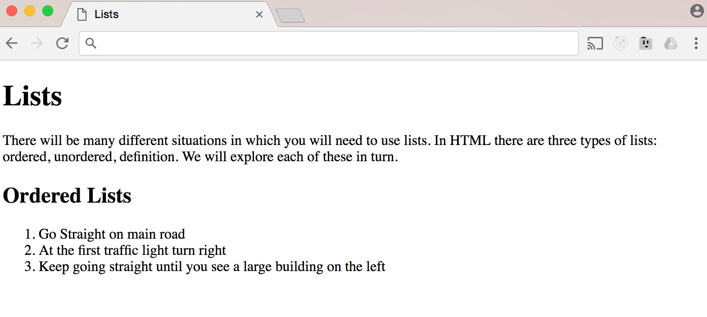
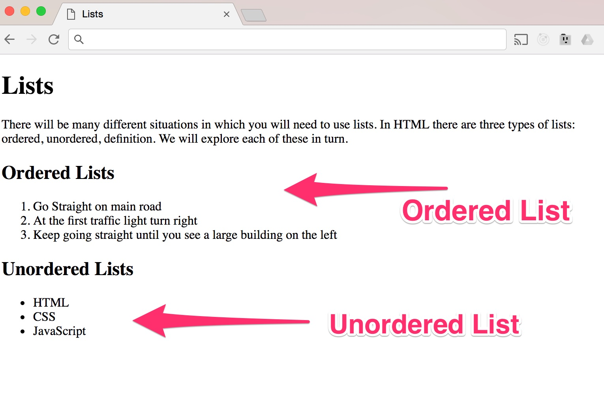

Lists 
------

There will be many different situations where you will need to use
lists. In HTML, there are three types of lists: ordered, unordered,
definition. We will explore the most common used lists, which are
ordered and unordered lists.

### Ordered Lists 

As the name suggests, these are lists where each item in the list is
ordered with a number. For example, if you had a set of instructions
that need to follow a particular order, you would use an ordered list.
You can create an ordered list using the *\<**ol**\>* tag element, which
acts as a container for all the items in the list. The individual list
items that live inside the *\<**ol**\>* tag will be placed between an
opening *\<**li**\>* and closing *\<**li**\>* list element. Note that li
has been shortened from list. Let's create an ordered list of
directions:

```html
<!DOCTYPE html> 
<html lang="en"> 
  <head> 
    <meta charset="utf-8" /> 
    <title>Lists</title> 
  </head> 
  <body> 
  	<h1>Lists</h1>
	<p>There will be many different situations in which you will need to use lists. In HTML there are three types of lists: ordered, unordered, definition. We will explore each of these in turn.</p>
	<h2>Ordered Lists</h2>
	<ol> 
	    <li>Go Straight on main road</li>
	    <li>At the first traffic light turn right</li>
	    <li>Keep going straight until you see a large building on the left</li> 
	</ol>
  </body> 
</html>
```



With ordered lists, you can create a list that is numbered, this means
that you don't have to explicitly specify each number on the list item.
Each ordered list will start from one and count upwards up to the number
of *\<**li**\>*elements that you add in between the *\<**ol**\>* tag. In
our example, we only have three list elements, which means that the
numbering will start from one and end at three.

**\
**

### Unordered Lists 

These are lists that begin with a bullet point instead of number like
its ordered list counterpart. Creating an unordered list is almost
identical to ordered lists, the main difference is that instead of using
the *\<**ol**\>* ordered list tag element, you use the *\<**ul**\>*
unordered list tag. In the same way that the *\<**ol**\>* tag was used
as the container for the list elements, the *\<**ul**\>* acts as the
container for each of the unordered list items that reside in between
the opening and closing tags. We will use an unordered list to list the
different technologies used to create websites on the web:

```html
<!DOCTYPE html> 
<html lang="en"> 
  <head> 
    <meta charset="utf-8" /> 
    <title>Lists</title> 
  </head> 
  <body> 
  	<h1>Lists</h1>
	<p>There will be many different situations in which you will need to use lists. In HTML there are three types of lists: ordered, unordered, definition. We will explore each of these in turn.</p>
	<h2>Ordered Lists</h2>
	<ol> 
	    <li>Go Straight on main road</li>
	    <li>At the first traffic light turn right</li>
	    <li>Keep going straight until you see a large building on the left</li> 
	</ol>
	<h2>Unordered Lists</h2>
	<ul>
	    <li>HTML</li>
	    <li>CSS</li>
	    <li>JavaScript</li>
	</ul>
  </body> 
</html>
```

Add this to the 10_lists.html file after the ordered lists and see
the result in the browser:



Lists are primarily a way of grouping things together, and lists are not
just to display a series of items. You can use lists to group similar
items together. The navigation links that you see on websites is an
unordered list that has been set to display as inline using CSS. We will
explore how we can style lists in the CSS section.
