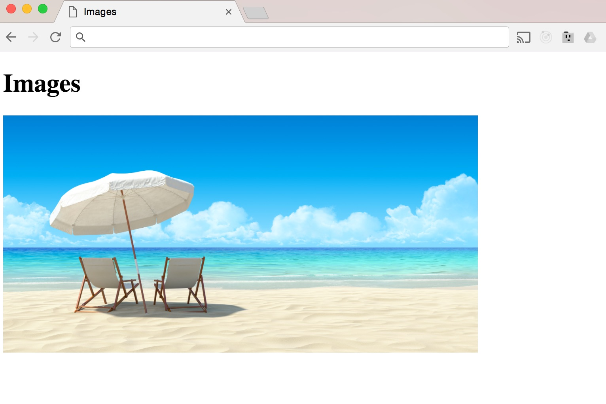

Images 
-------

Media files play an integral part in making the web interesting and
engaging for users. Rich media complements plain text in many ways and
images are at the heart of making the web what it is today. Images have
been included on websites for a long time, but support for different
types of images has improved over the years.

As you would expect, HTML lets you add images to your web pages using
the `` element. The `` tag is one of the few
self-closing tags in HTML and this also means that it doesn't wrap any
other content besides an image.

I have created a new file called 11_images.html and this is a
standard web page like the ones that we have been using with the
previous examples. Now in order for the image to display using the
`` tag, we need to use an attribute `src` whose value is a
URL, and this URL is usually relative to the server where a website is
hosted.

To add an image to the web page, we will use the `` and give
it a src attribute which stands for source, i.e. the location of the
image resource. We will also add another attribute, which will specify
the width of the image in pixels. Although you can control this with
CSS, you can also control the height and width using this inline-style
format, as our image is very big:

``

Along with the `src` and `width` attributes, we can add an `alt`
attribute, this describes the content of an image. This alt attribute is 
picked up by search engines like Google, and also screen readers to help 
convey the purpose of the image. Simply add this after the width attribute in your code:

` `

Note that this attribute does not add anything to the visual image, it
is only used by search engines and screen readers.

### Types of images 

Images come in a variety of different formats, and the most common
formats are *gif*, *jpg* and *png* images. All major browsers, Chrome,
Firefox, Internet Explorer and Safari, support these file formats. The
jpg format provides the most quality with high color counts while
maintaining an appropriate file size. The gif and the *png* format are
used for images with low color counts or large areas with the same
color.
