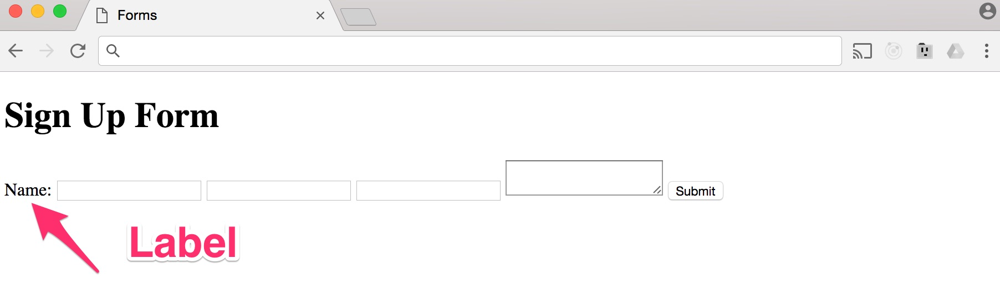

Forms 
------

Forms are an essential part of the web, as the web is a two-way
communication medium. As we've seen, there are lots of HTML elements for
displaying information, and conversely, there are also lots of HTML
elements for accepting input. The term 'form' usually refers to a
printed document that contains spaces for you to fill in information. In
HTML, forms are used to accept input from the user. This could be for
contacting someone, buying a product or even registering to vote. Forms
are an important part of web pages, and we'll learn about all of the
most important form elements that web developers use on a daily basis.

To learn about forms, we're going to create a simple sign up form for a
web app. We are going to focus on creating the form layout and not worry
about where the form will submit to and how to process the submitted
information, because we will need server processing to achieve this. For
this part, I will be starting with the file 13\_*forms.html* and we will
be building out the form one step at a time.

### Form Element 

The first element that we will learn about is the form tag element
*\<**form**\>*. This element acts as the container for all the other
form related elements that go inside the form. So, let's start by typing
this out into the file:

```html
<form>

</form>
```

If you save and preview this on the browser, you will not actually see
anything, as this element is the starting point for forms. Something
worth noting about forms is that you cannot have forms nested inside
other forms because this will simply not work. We mentioned previously
that our form won't actually submit anywhere for processing, however
this can be achieved using a server side language such as Node.js, PHP,
Ruby, or Python.

Part of processing the data involves two important attributes that are
added to the opening form tag and they are the action and method
attributes. The action attribute specifies the address to which this
form will be sent to, but since we don't have any server side program
that can process this form, I will just insert form.html as the value.

The method attribute specifies the method that I would like the browser
to use to submit the form. There are several different methods that we
can use, but usually when submitting a form to a serve,r the post method
is used. Here is how the table element looks like when we've added the
attributes:

```html 
<form action="form.html" method=”post”>

</form>
```

Another possible value that we could have used for the method is a GET.
POST corresponds to the HTTP POST method. This means that data from the
body of the form is sent, or posted, to the server. The GET corresponds
to the HTTP GET method, and in this case, the data is sent inside of the
URL, and parameters are separated with a question mark. Most of the
time, you\'ll use the POST method.

### Input Elements 

Now that we have created the containing form element, we will add an
input element *\<**input\>***. The input element is the most commonly
used form element and we\'ll start out with some simple text fields but
later on, we\'ll reuse the input element again in other ways for other
types of input. We're going to make a simple text field where the user
can type in their name. So, let's type it out and then go through the
code:

```html
<form action="form.html" method="post"> 
  <input type="text" id="name" name="user_name" /> 
</form>

```

We have created a self-closing input element and added three attributes.
The type attribute indicates what kind of input we want. There are many
possible values for this particular attribute, such as *email*, *tel*
for telephone, and *password* just to name a few. We\'ll be working with
more input types a bit later on.

The `id` attribute is not required, but it\'s a good idea to add one. In
some cases, this is helpful for targeting elements with CSS or
JavaScript. However, in our examples, we\'ll need the `id` attributes so
that we can associate labels to specific form controls. We\'ll learn
more about the label element very soon.

The name attribute is needed so that, when a form is submitted to
server-side code, the server can understand the form data and process
the values appropriately. We\'re going to prefix all our name values
with user and an underscore so that it\'s easier to tell the difference
between the name and the ID. Let's save changes and then switch to the
browser, refresh and see the result:


Let's add a few more text input fields, one for the email address and
one for the password:

```html
<form action="form.html" method="post">
  <input type="text" id="name" name="user_name"/>
  
  <input type="email" id="email" name="user_email" /> 
  <input type="password" id="password" name="user_password" />
</form>
```

Notice how we are reusing the input element, but for each instance we
are specifying a different value for the type attribute. There are many
more values that we can use to get different input values. For a
comprehensive list of all these values, visit this link
<https://goo.gl/3sQgYC>. Now we can save, switch to the browser refresh
and view the results so far:


So, here we have three input elements. The first one is for our name,
the second one is for an email address, and the last one is a password.
You will notice that in the final input element, when you start typing
into the field, you\'ll see that it automatically blocks out the
password that is typed in. Using different values for the type attribute
will produce different results.

As I\'ve mentioned previously, there are many use cases for the input
element and we will be using it again in a different way soon. A quick
note on the layout of the input fields: you will have noticed that they
are horizontally positioned next to each other. This is because we have
no CSS styling applied that dictates how they are positioned.

### Text Area Element 

The input element is great for entering names, usernames and passwords,
however, sometimes a single line of text isn\'t enough and a simple
input element won\'t work. For example, maybe you have a contact form
and you need a place for people to type a message. In this case, it's
best to use the `<textarea>` element `<textarea>`.

In our form, we will add a text area so that users can type in
sentences. So, after the password input element, add the following code
for a textarea:

```html
<textarea id="bio" name="user_bio">

</textarea>
```

If we save and switch back to the browser and refresh, you can see that
the text area allows us to type in multiple lines:


On the bottom right corner of the text area element is a little
triangle. What this means is that we can resize the text area if we
wanted to. As you can see, the `<textarea>` element is different from
the input element, in that it isn't a self-closing tag. You need to type
an opening and a closing tag for it to work.

In most browsers, a text area is resizable by the user. There are ways
to prevent this if you like, but it is highly recommended to leave this
default behavior unmodified. That way, if the user would like more space
to type in any direction, they can adjust it however they want.

### Button Element 

A form is not complete without a submit button and in HTML, there are a
couple of ways for creating a button, and you will likely see one or the
other when you look at the source code of other web pages. We're going
to look at both ways of creating a button starting with using the input
element again. As you've already seen, the input tag can be used to
create different elements on the web page simply by specifying a
different type value.

When using the input tag to create a button, we give the *type*
attribute a value of *button*, and we add another attribute called
value, whose value will be the text for the button. Let's code this out.
Put the following markup after the text area element:

`<input type="button" value="Submit" id="submit">`

As you can see, we have used the input tag again. Along with specifying
button as the type, we need to also specify a value attribute and the
value for this attribute will be the text that is displayed on the
button. Let's save this, switch to the browser and refresh:


The second way that we can create a button is using the button element `<button>`. 
Unlike the input element, the button element has a
closing tag. To add a button using the *\<**button**\>* is
straightforward:

`<button type="submit" id="submit">Submit</button>`

The type value in this particular case is *submit*. But there are two
other types called Reset and Button. The Reset type will automatically
clear all form data when it\'s clicked. The Button type has no default
behavior, and it\'s mostly intended to be used in combination with
JavaScript. The type value we\'ve used here is *submit*. As the name
implies, the default behavior of the *submit* type is to submit the form
and send all the data over to the server. Let's save this and switch to
the browser and refresh:


You will notice that there is no change in the output on the web page.
You can use either the input element or the button element to create a
button in HTML.

### Labels and Fieldsets 

At the moment, it's difficult for the user to tell which form control
does what. There's no way to know if the bio field is for their email or
if the email field is for their password. As you have already seen, a
form can be created with just the form element and input tags. However,
it's helpful to the user if the form is organized with labels and
fieldset elements.

Let's start by adding a label for the name field. We will use the label
tag \<label\>. This tag requires an opening and closing, so we're going
to add a label just before the input field for the name:

```html
<label for="name">Name:</label>
<input type="text" id="name" name="user_name" />
```

For the label to be added to the correct field, we need to specify a
`for` attribute and the value for this will be the id of the name field,
which happens to be called name. This is why we added IDs to our form
controls so that we can add labels and reference each field with an id.
Save your changes then switch to your browser and refresh:



As you can see, this has now added a label for the name field. The user
can distinguish what needs to be entered in this field. Let's add a
label for each of the form controls:

```html
<label for="name">Name:</label>
<input type="text" id="name" name="user_name" />

<label for="email">Email:</label>
<input type="email" id="email" name="user_email" />

<label for="password">Password:</label>
<input type="password" id="password" name="user_password" />

<label for="bio">Your bio:</label>
<textarea id="bio" name="user_bio">
</textarea>
```

Now that we have added labels for each of the form controls, we can save
our changes and switch to the browser and refresh to see the result:


Our form is starting to take shape and the user can now fill out the
form and know what is required in each form field. Let's now look at how
we can use `fieldset` to group similar form controls together.

### Fieldset and Legend

The main purpose of a `fieldset` is to group together form controls.
Sometimes, certain form controls belong together in a logical grouping.
In our case, we will create two groups, one for basic information and
one for information that will show up in the user's profile. Wrapping
our form controls using the `fieldset` element can do this.

We'll wrap all the input fields and the labels in a `fieldset`
element and the text area and its label can be wrapped in another
`fieldset`:

```html
<fieldset>
  <label for="name">Name:</label>
  <input type="text" id="name" name="user_name" />
  <label for="email">Email:</label>
  <input type="email" id="email" name="user_email" />
  <label for="password">Password:</label>
  <input type="password" id="password" name="user_password" />
</fieldset>

<fieldset>
    <label for="bio">Your bio:</label>
    <textarea id="bio" name="user_bio">
    </textarea>
</fieldset>
<button type="submit" id="submit">Submit</button>
```

This creates a logical grouping of the form controls, all the input
elements and their labels are grouped into one `fieldset` and the
`<textarea>` element and its label are put into another logical group.
If you had more fields, you could use more `fieldset` to group them
together. If we save and switch over to the browser, then refresh, we
can see these logical groupings applied visually:


The default user agent or browser CSS applies a border to each
`<fieldset>` to show that they are grouped together in a
`<fieldset>`. We can use CSS to override the default styling and apply
our own custom CSS.

In addition to grouping the form elements into `fieldset`, we can
also label the different logical groupings and we can achieve this using
the HTML legend element. The legend element has both an opening and
closing tag and we place this just after the first opening
`fieldset` tag for each logical grouping:

```html
<fieldset>
  <legend>Basic Info</legend>

  <label for="name">Name:</label>
  <input type="text" id="name" name="user_name" />

  <label for="email">Email:</label>
  <input type="email" id="email" name="user_email" />
  <label for="password">Password:</label>
  <input type="password" id="password" name="user_password" />
</fieldset>

<fieldset>
    <legend>Profile</legend>

    <label for="bio">Your bio:</label>
    <textarea id="bio" name="user_bio">
    </textarea>

</fieldset>
<button type="submit" id="submit">Submit</button>
```

The legend element will label each `fieldset`. I have labelled the
first `fieldset` basic info and the second one profile. Let's save
our changes and then switch to the browser and refresh to see the
results:


As you can see once again, the default browser styling is being applied
to the legend element. You can easily change this using CSS. If you
think back to the last time you filled out a form, it is more than
likely you were presented with predefined options to choose from at some
point. We can add predefined options using menus, radio buttons, or
checkboxes.

### Select Menus 

Depending on the type of predefined options that you are presenting to
your user, you will at some point have the need to list several options
for the user to choose from. In this situation, it's best to go with a
select menu. Let's say that in our form we want to capture the job title
of the person filling out our form. For this we are going to list four
job titles: Web Designer, User Experience, Front-end Developer, and
Back-end Developer. We will present these options as a select menu.

So, under the biography, which is represented by the ***textarea***
element, we will add our select menu options using the \<select\>
element. Just before adding the select menu, we will create a label for
the select menu and then the select menu itself:

```html
  <label for="job-title">Job Title</label>
  <select id="job-title" name="user_job-title">
    <option value="web-designer">Web Designer</option>
    <option value="user-experience">User Experience</option>
    <option value="front-end-developer">Front-end Developer</option>
    <option value="backend-developer">Back-end Developer</option>
    <option value="business-owner">Business Owner</option>
    <option value="freelancer">Freelancer</option>
  </select>
```

We create the label just like we have done previously, so there is
nothing new there. The select element acts as the container for each of
the options that the user will be able to choose from a drop-down menu.
I have given the select element an ID of job-title as this should match
the value for the `for` attribute and we have also added a `name`
attribute with the value of *user_job-title. To actually get options
listed in a select menu, we need to add option elements, and these are a
pair of opening and closing tags.

Inside each option element we need to add a *value* attribute, which
corresponds to the option that is presented to the user. The idea here
is that when you submit the form to the server side code, each form
element has an associated value for text inputs and text areas, and this
value is whatever the user types into the field. Since we're creating
these predefined options, we need to specify what the value should be
when selected by the user and the form is submitted. Let's save what we
have added, then switch over to the browser:


As you can see, we have a nice select menu along with its label. If you
click on the drop down, you will see that all our job titles are listed:

{width="2.432014435695538in"
height="1.6088713910761154in"}

We can further organize our list of job titles, just like we organized
the form controls using ***fieldset***, by using the *\<**optgroup**\>*
element, which stands for option group. Just like the fieldset element,
the *\<**optgroup**\>* tag wraps around a group of option tags. We will
add two *\<**optgroup**\>* tags, one for development roles and the other
for business related roles:

*\<**label** for=\"job-title\"\>Job Title\</**label**\>*

*\<**select** id=\"job-title\" name=\"user\_job-title\"\>*

*\<**optgroup** label=\"Development\"\> *

*\<**option** value=\"web-designer\"\>Web Designer\</**option**\>*

*\<**option** value=\"user-experience\"\>User Experience\</**option**\>*

*\<**option** value=\"front-end-developer\"\>Front-end
Developer\</**option**\>*

*\<**option** value=\"backend-developer\"\>Back-end
Developer\</**option**\>*

*\</**optgroup**\>*

*\<**optgroup** label =\"Business\"\> *

*\<**option** value=\"business-owner\"\>Business Owner\</**option**\> *

*\<**option** value=\"freelancer\"\>Freelancer\</**option**\>*

*\</**optgroup**\>*

*\</**select**\>*

We have now created two option groups, one for development and one for
business. You will note that the *\<**optgroup**\>* element has an
attribute of *label*. This is not the same as the label element, and the
role of this attribute is to display a label inside the dropdown menu
for each respective group. Save everything, and the switch to the
browser and refresh:

{width="2.3826388888888888in"
height="1.6692300962379703in"}

You can see that our options are organized neatly into two groups:
Development and Business. The actual labels themselves are not
selectable, as they are not part of the options. You can also further
style this using CSS to add maybe a horizontal line after the labels to
make it look more visually appealing.

### Radio Buttons 

We have quite a few options when it comes to presenting our users with
predefined options. The select menu is great for lots of options,
however, if you have something like five or less options, then it's
better to use radio buttons. Just like select menus, the user can only
pick from the options given. In our form, let's say that we have some
terms and conditions and we want to know whether the person signing up
has read and agrees to them. For this we will use radio buttons.

Just after the select menu we will add two labels, and inside these
labels we will add *I agree to T&Cs* and *I disagree* respectively.
After each label, we will add our radio button for each option:

*\<**label**\>I agree to T&amp;Cs\</**label**\>*

*\<**input** type=\"radio\" id=\"agree\" value=\"agree\"
name=\"user\_agree\" /\>*

*\<**label**\>I disagree\</**label**\>*

*\<**input** type=\"radio\" id=\"disagree\" value=\"disagree\"
name=\"user\_agree\" /\>*

You will notice that the labels do not have a *for* attribute, and to
create radio buttons I am using the input element once again, only this
time the type value is radio. We have also created id attributes that
correspond to user choices, whether they agree or disagree. If we now
save this and switch over to the browser and refresh, we can see our two
radio buttons:

{width="4.707650918635171in"
height="1.6612904636920385in"}

In the HTML markup, the name value is the same for both radio buttons.
This is to prevent the user from selecting both radio buttons. At the
moment, when you select one radio button and then try to select another
option, you\'ll see that

the browser deselects the previous option, and the way that it knows to
do that is because we have the name attribute exactly the same. So, it
knows that these two radio buttons are part of the same group.

We have not added any new markup besides the type value for the input to
create the radio buttons. All of the other attributes are pretty much
self-explanatory.

### Checkboxes 

Forms can contain a variety of options. Sometimes, you might have a
group of predefined options, but you want the user to be able to select
multiple options and not just one of them. HTML gives us the option to
use checkboxes, and that's what we will be adding to our form next. In
our sign up form, let's say that we wanted the user to be able to tell
us which major topic areas are interesting to them. They might be
interested in more than one topic, and this is perfectly acceptable as
we can use checkboxes to receive this input. I'll add some checkboxes
just after the closing select menu element and before the radio buttons
inside a new third ***fieldset*** element:

*\<**fieldset**\>*

*\<**label**\>Interested to learn about:\</label\>\<**br** /\>*

*\<**input** type=\"checkbox\" id=\"development\"
value=\"interest\_development\" name=\"user\_interest\" /\>*

*\<**label** for=\"development\"\>Development\</**label**\>\<**br** /\>*

*\<**input** type=\"checkbox\" id=\"design\" value=\"interest\_design\"
name=\"user\_interest\"\>*

*\<**label** for=\"development\"\>Design\</**label**\>\<**br** /\>*

*\<**input** type=\"checkbox\" id=\"business\"
value=\"interest\_business\" name=\"user\_interest\" /\>*

*\<**label** for=\"business\"\>business\</**label**\>\<br /\>*

*\<**label**\>I agree to T&amp;Cs\</**label**\>*

*\<**input** type=\"radio\" id=\"agree\" value=\"agree\"
name=\"user\_agree\" /\>*

*\<**label**\>I disagree\</label\>*

*\<**input** type=\"radio\" id=\"disagree\" value=\"disagree\"
name=\"user\_agree\"\>*

*\</**fieldset**\>*

Let's go through the code line by line. The first thing that I added
right after the closing ***fieldset*** tag for the text area and select
menu is a third ***fieldset*** group that will house the checkboxes and
the radio buttons. To do this, I created a new ***fieldset*** element
with opening and closing tags. Then I added a label, again without a
*for* attribute, to act as a title for the checkboxes. Inside the label,
I added the text *Interested to learn about*.

You will also see that I added a *\<**br** /\>* tag. This is to create a
new line for the checkbox and is something that I have added to the end
of each label for the checkboxes, so that we can have the checkboxes and
the labels positioned vertically.

Now it's time to actually add the checkboxes, and to do that, I used the
input element with the type value as a *checkbox*. This will create a
checkbox, but just like the elements that we have previously created, we
need to specify an *id* and a *value* attribute. The id attribute will
be used for labelling the checkbox and the value attribute is used on
the server side to ascertain what the user actually selected.

For each of the values I have prefixed interest and then followed by an
underscore and the actual topic. So this is not new, as we've actually
done something like this with the select menus. Then I added a label for
each interest, and this label has a *for* attribute so that it is
associated with the correct input element. This process is repeated for
each of the three interests that are listed for the user to select from.
If we save the code and switch to the browser and refresh, we can see
that we now have the option for the user to select one or more interests
via checkboxes:

{width="4.707670603674541in"
height="2.1048392388451442in"}

Forms play an important role in gathering data from users, and as we've
seen, HTML provides us with all the tools that we need to replicate the
traditional paper based forms that we have become accustomed to.
