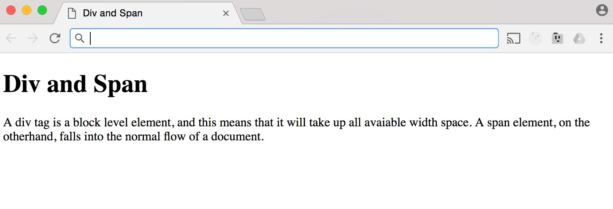

HTML Special Characters
-----------------------

In HTML, we can pretty much display all kinds of characters, however,
there are special characters that include various punctuation marks,
accented letters, and symbols. When we type these directly into the HTML
code, they can be mistaken for the wrong character, and this means that
special characters need to be encoded.

There are hundreds of special characters that can be used with HTML, and
these are encoded between an ampersand & and a semi-colon. Everything
between the ampersand and the semi-colon is a character's unique
encoding; this could be a name or numeric encoding.

When you want to include an ampersand, you have to use its special
encoding characters so that the browser renders it properly. You might
have noticed in our code for the form when we created the label for the
radio button that we used an encoding to display the ampersand: *&amp;*.
If you simply type out the ampersand as you would in a word processor,
some browsers will display a weird looking character. Likewise, if you
want to display the @ or copyright symbols, you would use `&commat;` and
`&copy;` respectively. For a full list of how to encode special
characters in HTML, visit <http://goo.gl/TDBevm>


IDs & Classes 
--------------

One concept that is important for all web designers and developers to
understand is that of IDs and classes. We have already used IDs quite a
lot so far, as we needed these to match up labels with the correct
elements. Both IDs and classes can be added as attributes of any HTML
element. If you think back to all of the markup that we have coded up,
we can add either an id or a class, or even both. We haven't added any
classes so far to our mark up. This is because they are primarily used
for styling and we haven't added any styling to our HTML so far.

### ID's are unique and classes are not 

Each element on a web page can have only one ID attribute, and each page
can only have one element with that ID. When you are first starting out
in web design and development, this is something that you will hear time
and time again. You should never use an ID more than once in any
instance on an element or each web page. Code that has multiple IDs that
are the same on one page will not pass validation. Furthermore, when you
add more functionality using JavaScript, and you are trying to get the
value of an element with a specific ID, you will run into issues and
this could create bugs on your web page or web app.

IDs also have a special functionality that is not available with
classes, and that is when they are used with hash values in a URL. If
you think back to the section where we created hyperlinks within a web
page, we used an ID to act as the location, and in the value for the
href, we simply prefixed the hash or pound symbol (\#), and used the ID
value of where we wanted to the browser to scroll to.

Classes, on the other hand, are not unique, and you can use the same
class on multiple elements, and you can also add multiple classes to the
same element. This is really useful, because it means any styling
information that needs to be applied to multiple objects on a page can
be done with just one class. This means that in your CSS, you create
style declarations under that name and when you add that class as an
attribute to any element on the web page, it will have that styling
applied to it. This is something that we will be doing extensively in
the CSS section.

We add classes the same way that we have been adding IDs to the
elements. Let's say that we want to add a class to the *\</**h1**\>* tag
in our form page. We simply add the word class as an attribute and the
value is whatever name we want to use for the class:

`<h1 class="heading-one">Sign Up Form</h1>`

You can use whatever name you would like as the class name. The class
name must be between either single or double quotes, and there must be
no space between multiple words. If you add a space between multiple
words, each instance of the word on its own will be a class. You can
distinguish multiple words by using either a hyphen, camel case, (this
is making each subsequent word's first letter upper case -e.g.
headingOne), or use an underscore character: heading_one.

If you want to apply additional styling that is unique to an element
that shares styling with several other elements, you can do so by adding
additional classes with a space:

`<h1 class="heading-one another-class ">Sign Up Form</h1>`

The heading element now has two classes and you can add additional
styling using the second class that will only be applied to this h1 tag
or wherever else it is used. You can add as many classes as you need, as
most browsers support any number of them and way more than you'll ever
need.

It's also worth knowing that simply applying an id or a class will not
do anything to that element, unless you have added a specific styling
for that class and the CSS is linked to the web page. However, there are
instances when you can simply add a class to any element and styling
will be applied when you save and reload. This is if you load
pre-written CSS styles into your web page and you simply add the classes
defined in the CSS to the elements to apply the styling. A popular
example of this is [Twitter's bootstrap](http://getbootstrap.com/css/)
framework: <http://getbootstrap.com/css/>

The fact that you can add IDs and classes doesn't mean that you should
be adding them to every element. You should use IDs and classes
judiciously and semantically. Only add them when there is an actual
need, as you will be able to apply styling to most elements using only a
few classes and the element tags.

Span & Div 
-----------

As we have already seen with the `<em>` and `<strong>`
elements, you can add semantics, which is just a fancy word for giving
content on the page meaning and structure, within HTML. However, there
are two elements that are widely used but don't actually hold any
semantic value, these are the division `<div>` and `<span>`
elements.

These two elements act as containers for styling purposes, and as such,
do not come with any semantic meaning or value. Before exploring these
two elements, we need to understand what is meant by a block and inline
element.

Whenever you hear that an element is a block-level element, what this
means is that this kind of element begins on a new line, and that it
occupies any available width. Block-level elements can be nested inside
one another. Examples of block-level elements include *\<**h1**\>*,
*\<**p**\>* and *\<**div**\>*.

Inline-level elements do not begin on a new line, instead they fall into
the normal flow of a document, lining up one after the other. Inline
elements only maintain the width of their content, and they can be
nested inside one another. Examples of inline elements that we have used
so far include: the anchor tag *\<**a**\>*, the image tag *\<**img**\>*
and the *\<**span**\>*.

A `<div>` is a block-level element that is used as container for
large groupings of content, which helps to build a web page's layout and
design. A `<span>`, on the other hand, is an inline-level element,
which is used as a container for smaller groupings of text within a
block-level element. More than likely, you will see *\<**div**\>* and
*\<**span**\>* with class or id attributes for styling purposes. Let'
see the two elements in action. For these examples, I'm using the file
*14\_div-span.html*.

```html
<!DOCTYPE html>
<html>
	<head>
		<title>Div and Span</title>
	</head>
	<body>
		<h1>Div and Span</h1>
		<div>
			<p>
A div tag is a block level element, and this means that it will take up all available width space. A <span>span</span> element, on the other hand, falls into the normal flow of a document.
			</p>
		</div>
	</body>
</html>
```

*A div tag is a block level element, and this means that it will take up
all available width space. A **\<span\>**span**\<**/**span\>** element,
on the other hand, falls into the normal flow of a document.*

*\</**p**\>*

*\</**div**\>*

*\</**body**\>*

*\</**html**\>*

{width="4.625in"
height="1.580858486439195in"}

Here I have added a div, nested inside this is a paragraph, which
contains some text and a span element. You will notice that the
*\<**div**\>* sits on its own new line, as it's a block level element,
whereas the *\<**span**\>* element falls nicely into the flow of the
text without taking up all available width. Even though these two
elements don't have any semantic meaning or value, they are nonetheless
very useful and widely used.
