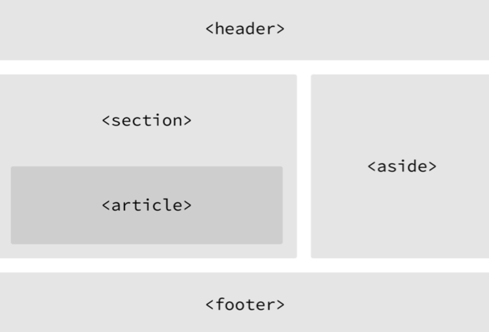
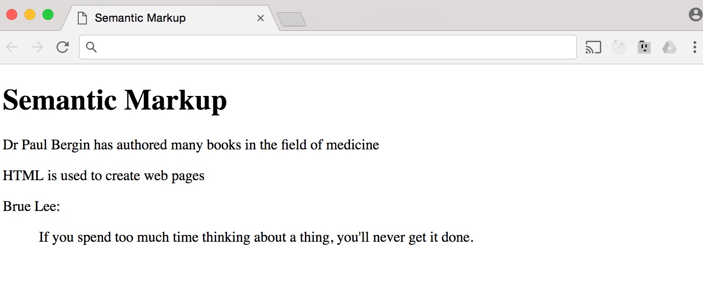

HTML5 Web Page Structure 
-------------------------

The latest edition of HTML, which is HTML5, added semantic elements to
provide meaning and structure to web page documents. Some of these
elements that add semantics and structure include: `<header`,
`<section>`, `<article>`, `<aside>`, and
`<footer>`. All these elements are block-level, and simply using
them instead of `<div>` to structure your page won't apply any
positioning or styles, these have to be added via CSS.

Let's take a visual look at how we can use the HTML5 elements to create
structured web page documents with semantic value:



### Header 

The header element, as its name suggests, is used to create a container
for the top of the page. In most websites that make use of the HTML5
structuring elements, you will also have a heading, text and the
navigation inside the header element. Sometimes it's easy to confuse the
`<header` element with the `<head>`. The `<head>`
element comes before any structuring of the page is actually created.
This is where you add the page title, any meta tags and references to
any style sheets. So going forward, make sure to use the correct element
when creating your web pages.

### Navigation 

Within the `<header>` element, you typically add the navigational
links on the website. HTML5 now has a `<nav>` element that you can
use as a container for all the links to other pages on the website.

### Section 

The `<section>`, element is used to group related content into
their own section. Much like you would use the `<div>` element as
a container for a group of elements and to also apply styling, you can
do the same with the `<section>` element.

### Article 

The `<article>` element can be used to identify a section of
independent, self-contained content. You can use the `<article>`
content for blog posts, newspaper articles etc. This element acts as a
wrapper for content that can be removed from the web page without having
any impact on the semantic structure of the web page. In order to help
you determine when to use the `<article>` element, you just need
to check if the content can be replicated elsewhere without any
confusion. For example, if the content within the `<article>`
element is removed from the context of the page, and put inside a
magazine, this content should still make sense on its own.

### When to use `<section\>` or `<article>` 

The article and section elements are probably the most confusing to web
designers and developers. To most people, these elements seem very
similar and there\'s a lot of confusion, even among experienced
developers, around when to use one over another. In many cases, it\'s
really just a judgement call as to which one to use.

### Aside 

One of the most common elements of websites is the sidebar. They\'re so
ubiquitous; in fact, that it can seem rather odd if you go to a site and
it doesn\'t have one. However, even though they are one of the most
common page elements of all time, until the HTML5 specification, there
wasn\'t a semantic element designed to represent the type of content
that you would normally associate with a sidebar.

The `<aside>` element represents a section of a page, which consists of
content that is loosely related to the content around the aside element.
You would typically see content that is found in a sidebar to be put in
its own section in printed typography, also in a sidebar.

The element could be used for typographical effects like quotes or
sidebars, for advertising, for groups of `<av>` elements and for
other content that is considered separate from the main content of the
page. The aside element is a sectional element, and this means that if
it\'s used in your content, there\'s a new section in the document.

### Footer 

The `<footer>` element identifies the closing or end of a page,
article, section, or other segment of a page. Generally, the
`<footer>` element is found at the bottom of its parent. Content
within the `<footer>` element should be relative information such as
links to other sections of the web page, contact details, disclaimers
etc.

### Abbreviations, Acronyms & Quotes 

In HTML, there are some text elements that are not intended to affect
the structure of your web pages, but their main purpose is to add extra
information to the web page. If you want to include an abbreviation or
an acronym, then you can use the `<abbr>` element. Let's look at
an example. I'm using the file *15*\_*semantic-markup.html*:

```html
<!DOCTYPE html>
<html>
  <head>
	<title>Semantic Markup</title>
  </head>
  <body>
	<h1>Semantic Markup</h1>
	<p><abbr title="Doctor">Dr</abbr> Paul Bergin has authored many books in the field of medicine</p>

	<p><abbr title="HyperText Markup Language">HTML</abbr> is used to create web pages</p>
  </body>
</html>
```

When you use the abbreviation element or an acronym, a title attribute
on the opening tag is used to specify the full term. Before HTML5, a
separate element, `<acronym>`, was used for acronyms.

There will be times when you want to include a quote on your web pages,
and in HTML, there are two elements that can be used to help you achieve
this. The first is the `<blockquote>` element. This element is
used for longer quotes that take up an entire paragraph:

```html
<p>Brue Lee:</p>
<blockquote>
    If you spend too much time thinking about a thing, you'll never get it done. 
</blockquote>
```

Browsers usually indent the content of the `<blockquote>` element.
Let's save and switch to the browser then refresh:


