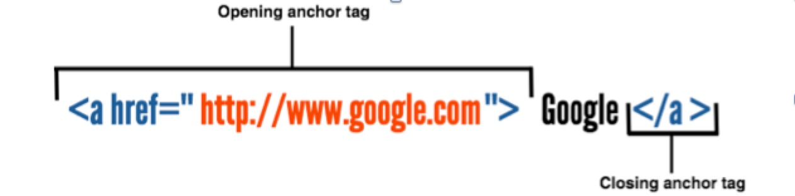
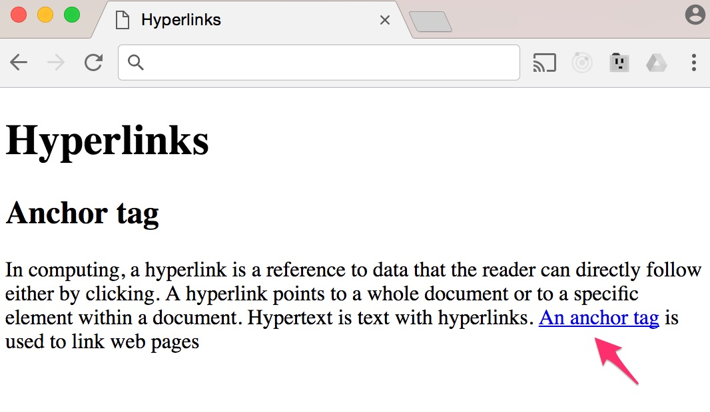
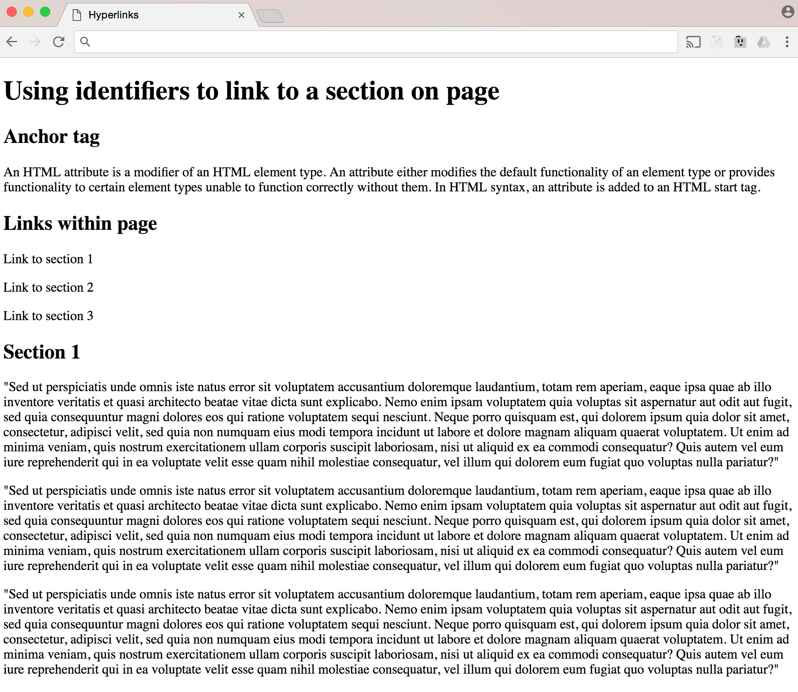
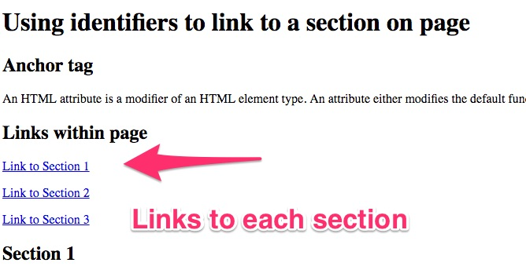

Hyperlinks
----------

One of the core components of web pages is the hyperlink. The World Wide
Web as we know it today is built on hyperlinks with millions of pages
interlinked on the Internet. The hyperlink provides the ability to link
from one web page or resource to another. Linking your web page to
another external page is just one part of the linking system in HTML.
There are several types of links. These include:

-   Links from one website to an external one

-   Link to another page within the same site

-   Link to another region on the same web page

The first time that you encounter the anchor element, it might be a bit
confusing because when you think of the logical naming for linking web
pages, it would be the link element. Well, that would seem to make
sense, but it\'s not what the link element is used for. Instead, the
link element is used to request external resources for the page such as
a CSS or JavaScript file. To create a link on the page, we use the
anchor element or *\</**a**\>* tag. This tag is at the center of all
linking on the World Wide Web. The anchor tag element takes both an
opening and closing tag. Let's explore the way you would create a link
using an anchor tag:

{width="4.870653980752406in"
height="1.1745374015748031in"}

The above shows how you would create a link using the anchor
*\</**a**\>* element. You would write the opening a tag and the word
*href* as an attribute, and this is the hyper link reference. Then, you
would write the equals symbol followed by the URL, the location of the
page that you are linking to.

In this case, it's Google's home page. It's important to wrap the URL
inside the quotes otherwise the link will not work. Next you have the
text that will actually be the link which is clicked, in this example it
is *Google* -- however this can be whatever you like, usually it's a
reference to the name of the web page or resource that you are linking
to. Creating links will always follow this pattern.

**\
**

Link to an external web page or another page within the same site
-----------------------------------------------------------------

Let's now create a link to one of the most visited pages on the web,
Wikipedia. In particular, we will link to the Wikipedia page for the
anchor tag element. I have added a short description of what the anchor
tag does as a paragraph and then we will add a link using the word
anchor tag:

*\<**h2**\>Anchor tag\</**h2**\>*

*\<**p**\>In computing, a hyperlink is a reference to data that the
reader can directly follow either by clicking. A hyperlink points to a
whole document or to a specific element within a document. Hypertext is
text with hyperlinks. \<**a**
href=\"https://en.wikipedia.org/wiki/Hyperlink\"\>An anchor
tag\</**a**\> is used to link web pages\</**p**\>*

Make sure to add the above HTML content in your HTML file or open the
*9\_hyperlinks.html* file from the exercise files:

{width="3.6123239282589674in"
height="2.1008059930008747in"}

Linking to another region within the same page 
-----------------------------------------------

In addition to linking to external pages on the web, anchor tags allow
you to jump to a specific section within a document. This type of
linking within a single page can be extremely helpful in enhancing your
site's navigation, especially when you have a page with lots of content
that needs scrolling. Linking to sections on your site follows the same
process for linking to external pages. I have a page with some dummy
text separated into three sections. If you open the file
*9a\_hyperlinks.html*:

{width="3.875in"
height="3.3595778652668415in"}

I have created three paragraphs that will act as the link for each
section, so next we will create a link to section 1, 2 and 3. In order
make these three paragraphs links, we need to follow a two-step process.
The first step is to create an ID for each section that we want to
create a link for. So, in the HTML for the web page, scroll to the first
*\<**h2**\>* tag heading that says *Section 1* that will act as the
anchor text for the first section and add an *id* attribute with the
value one:

*\<**h2** id=\"one\"\>Section 1\</**h2**\>*

We have added an *id* attribute with a value of *one*. We will look at
IDs in more detail later on, but essentially, ID's are unique attributes
that you can assign to elements. This means that if you give an element
an ID, that will be unique to that element only. In this case, we have
given the ID of 'one' to the first h2 heading title of the sections.

The second step is to now use this unique ID to create a link using the
a tag on the text that we have already created to act as the link for
each section. To do that, just scroll to where it says *Link to section
1* and then we're going to add a link using the a tag as before, but
only this time we will precede the link with a pound or hash symbol as
follows:

*\<**p**\>\<**a** href=\"\#one\"\>Link to section 1\</**a**\>\</**p**\>*

We can repeat this two-step process to create links for the two other
sections on the page. Create an ID attribute for each h2 title heading
with values of two and three respectively:

*\<**h2** id=\"two\"\>Section 2\</**h2**\>*

*\<**h2** id=\"three\"\>Section 3\</**h2**\>*

Then use the unique IDs to create links on the two remaining paragraphs
that act as the text, which will become links:

*\<**p**\>\<**a** href=\"\#one\"\>Link to Section 1\</**a**\>\</**p**\>*

*\<**p**\>\<**a** href=\"\#two\"\>Link to Section 2\</**a**\>\</**p**\>*

*\<**p**\>\<**a** href=\"\#three\"\>Link to Section
3\</**a**\>\</**p**\>*

Let's save the changes and switch to the browser to see the results:

{width="4.35378280839895in"
height="2.2419356955380576in"}

As you can see from the screenshot above, all the paragraph texts have
now become links to each respective section. Clicking on each link will
take you to that section further down the page.

### Relative and absolute paths

The two most common types of links are links to other pages on the same
website, and links to external resources on other websites on the web.
Both of these types of links use the ***a*** tag to create the link
between the web pages, and the only difference is how you link to them
using the *href* attribute values, which are also known as paths.

When linking to another page on the same website, you will use a
relative path. This means that the URL or path does not include the
domain. For example, if you want to link to the about page on your site
and it happens to be called [www.mysite.com](http://www.mysite.com),
then you wouldn't include the domain name as in:
[www.mysite.com/about](http://www.mysite.com/about). Instead, your
*href* attribute would have a value of just the name of the page so it
would be: *\<**a*** *href* =''*about.html"\>About Us\</**a**\>*, because
the link is pointing to another page on the same website which you are
already on. So, there is no need to give the full *URL* address to get
to the page you are just accessing another page on the same website.

Also, the about page could be inside another directory called pages, for
example. This will also be reflected in the href value: *\<**a** href*
*="pages/about.html"\>About Us\</**a**\>*.

If the page you are linking to is on an external location, then you will
need to use an absolute path. In this instance, the *href* attribute
value must include the full domain. For example, if I want to link to
the about page of Facebook, the path would include the full domain plus
the name of the about page, which they have just called facebook:
*<http://www.facebook.com/facebook>. *

### Opening links in a new window

So far, all of the links that we have created open on the same window or
tab in the browser. But sometimes the user wants to open the link on a
new window or tab, so that they can come back to it after going to the
link. This is a feature that is available in hyperlinks that can be done
easily by adding another attribute after the *href* called *target*. To
open the links in a new window or tab, just use this attribute along
with the value of blank. So, if we wanted to open the about page of
Facebook in a new window or tab, we would just add the target attribute
with a value of underscore followed by the word blank:

*\<**a** href* *="http://www.facebook.com/facebook"
target="\_blank\>About Us\</**a**\>*

The *target* attribute determines exactly where the link will be
displayed, and the *\_blank* value specifies a new window.
