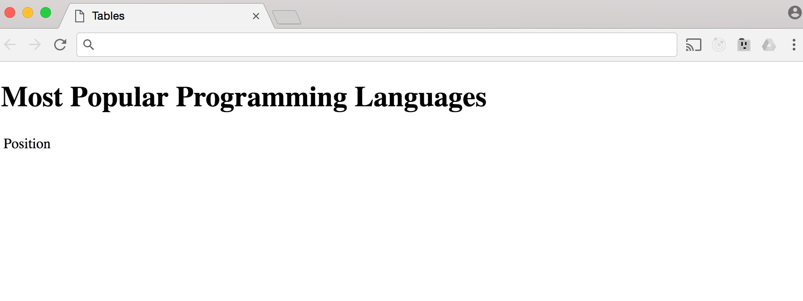
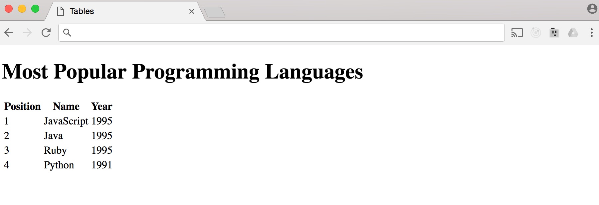
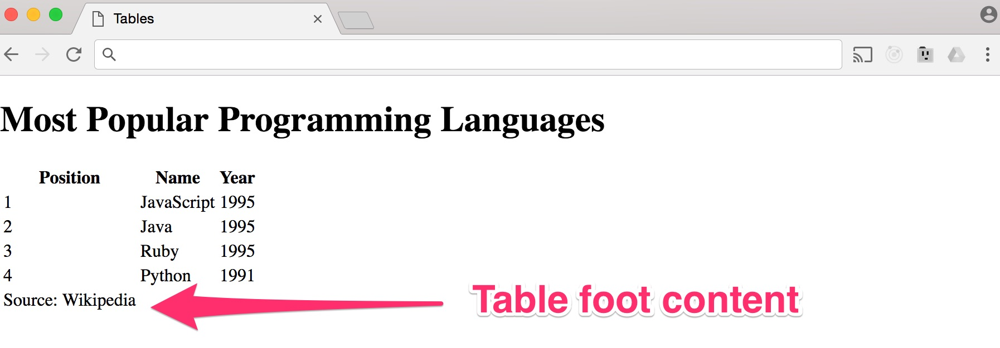
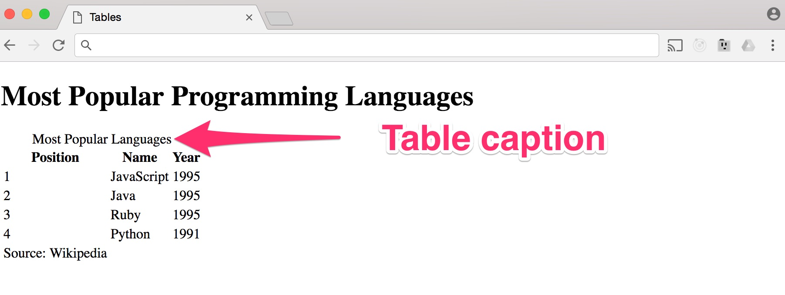

Tables 
-------

The web is made of rich media including text and images, but another
important element that is used to present information is a table. Tables
are used to present information in a structured and visually appealing
way. Things like sports scores, list of employee names, email addresses,
and recipes can be presented with tables. HTML gives you the option to
display information in a tabular format, using columns and rows. So, if
you want to represent data from a spreadsheet on a web page, you can
easily display this using HTML tables. There are many uses for using
tables to present data, so we'll explore how to display information
using tables.

It's worth mentioning that tables are little bit more involved than
other HTML elements like paragraphs and images, because in order to
construct a table, we need to use elements to represent the individual
table, the rows that contain those cells, as well as the table itself.

You start out creating an HTML table by using the `<table>`
element. This element has an opening `<table>` and closing tag
`<table>`, and it wraps all the table rows and table cells,
inside of it much like a container. I have the file *12_tables.html,
and inside this file we will create our table element, which acts as a
container for all of the other elements that make up a table:

`<table> </table>`

This is the first thing that we need to do when creating a table.
You\'ll also notice that I have not typed any attributes. That\'s
because tables have no attributes. Previous versions of HTML had
attributes, however, these have all now been removed, and you shouldn't
add any attributes to the table element.

Next, we need to add a table row. Tables are made up of rows of
information, that go across the page. There are no columns that go up
and down. Columns in HTML are implicit and come about as result of any
number of cells that we add to each row. To add a table row, we add an
opening and closing `<tr>` tag inside of the table element:

```html
<table>
    <tr></tr>
</table>
```

Now that we have a table row, we need a table cell to contain our data.
There shouldn\'t be any content outside of a table cell, such as inside
a row, for example. To add a table cell, we simply insert a pair of
opening and closing *\<**td**\>* tags inside our table row element:

```html
<h1>Most Popular Programming Languages</h1>
<table>
    <tr>
        <td>Position</td>
    </tr>
</table>
```

Now that we have a table cell, we can add some data inside it. We will
be creating a table of popular programming languages. If you save what
you have added so far and view it in the browser, you will see that we
have a column, which is the heading for the position of the programming
language:



We can create more columns by listing multiple *\<**td**\>* elements one
after the other inside the first row. So, we can add two more columns
using the *\<**td**\>*tag, one for the name of the language and the
other will contain the year when the language first came out:

```html
<table>
    <tr>
        <td>Position</td>
        <td>Name</td>
        <td>Year</td>
    </tr>
</table>
```

If we now preview our table so far, we will see that we have added two
more columns:


You will notice that our table does not have any borders and the text
for each column is not highlighted. As with anything in HTML, you can
control the styling, and layout with CSS. We will use another table
element called table head denoted by *\<**th**\>*. The *\<**th**\>*
element has an opening and closing tag just like the table cell, we can
add our data inside this element and it would display it like the table
cell. However, the main difference is that the *\<**th**\>*element acts
as a header column for the data values that come below it. So, if we
replace our *\<**td**\>* cells with *\<**th**\>* tags:

```html
<table>
    <tr>
        <th>Position</th>
        <th>Name</th>
        <th>Year</th>
    </tr>
</table>
```

Then save our changes and switch to the browser to see the result:


We now have three column headings that have been emboldened, which will
act as our headings for the table. Now that we have added all the
columns, we will add four more rows along with table cells for each
position number, name and year:

```html
<table>
    <tr>
        <th>Position</th>
        <th>Name</th>
        <th>Year</th>
    </tr>
    <tr>
        <td>1</td>
        <td>JavaScript</td>
        <td>1995</td>
    </tr>

    <tr>
        <td>2</td>
        <td>Java</td>
        <td>1995</td>
    </tr>

    <tr>
        <td>3</td>
        <td>Ruby</td>
        <td>1995</td>
    </tr>
    <tr>
        <td>4</td>
        <td>Python</td>
        <td>1991</td>
    </tr>
</table>
```

We have added four more rows to the table to show the most popular
programming languages. Once you've added the rows and the table cells,
save and preview the table in the browser. Depending on your browser, it
should look something like this:



### Structuring Tables 

There is more to tables than just table rows and table cells. We can add
extra structure for search engines and screen readers. Also, adding
extra structure will come in useful when you want to apply styling, as
you can target the additional elements with CSS.

### Table Head and Body Elements 

Similar to the structure of an HTML document, where we have a head and a
body, we can also add a head and a body to our table. Now, we can\'t use
the same HTML elements, we can use another HTML element called the table
head element or `<thead>`. This element will wrap around the first
table row that contains our three `<th>` tags:

```html
<thead>
    <tr>
        <th>Position</th>
        <th>Name</th>
        <th>Year</th>
    </tr>
</thead>
```

The table head elements are not required to create a table, but it\'s
nice to define it for search engine crawlers and screen readers, and
it\'s also helpful for styling. When you save and preview this change,
you'll notice that it doesn't actually add anything to the visual
representation, however we can now target this element using CSS and
apply styling.

Next we will add a table body element `<tbody>`. The table body
will wrap all of the content of our table, except anything that actually
labels our columns, like the table head. Here is our table with a table
head and table body elements added:

```html
<table>
    <thead>
        <tr>
            <td>Position</td>
            <td>Name</td>
            <td>Year</td>
        </tr>
    </thead>
    <tbody>
        <tr>
            <td>1</td>
            <td>JavaScript</td>
            <td>1995</td>
        </tr>

        <tr>
            <td>2</td>
            <td>Java</td>
            <td>1995</td>
        </tr>

        <tr>
            <td>3</td>
            <td>Ruby</td>
            <td>1995</td>
        </tr>
        <tr>
            <td>4</td>
            <td>Python</td>
            <td>1991</td>
        </tr>
    </tbody>
</table>
```

Once again, adding this element will not add anything visual to our
table, however it will add meaning to our table structure and we can now
target different parts of the table easily with CSS for styling.

### Table Foot Element 

We have a table head and a table body. So, the next logical element to
have would be a table footer element, and that's exactly what we're
going to add next. However, you may be wondering why we would need a
table footer if we already have table headers that label columns and
rows? As with the table head and body elements, there isn't a strict
requirement for the table footer.

It's a nice element to have that should contain a summary of the table.
This could be some final cells that are sums, totals, and averages for
each column, or, meta-information about the table, such as how
frequently the table is updated, copyright information or perhaps the
source of the data within the table.

Now, you would think that the table footer would go at the bottom of the
table. However, the table footer element `<tfoot>` is placed right
after the table head element and just before the table body element. In
order to get content inside the table footer element, we will need to
add a table row and table cell tags inside it. Let's add it to our table:

```html
<tfoot>
    <tr>
        <td>
	Source: Wikipedia	
        </td>
    </tr>
</tfoot>
```

Add this piece right after the closing table head tag and just before
the opening table body tag, then save the changes and view the results
in the browser:



### Table Caption Element 

Another nice structural element for tables is the caption element. This
element is basically a title for the table, and it should come
immediately after the opening table tag. This is a really useful element
to include in your table, as it quickly summarizes what a table might
contain. Also, some screen reading software and search engines will pick
up the caption and so will have an idea of what the table is about.

To add the table caption element, just place an opening and closing
caption tag `<caption>` just after the opening table tag:

`<caption>Most Popular Languages</caption>`

This will add a nice table title at the top of the table, so save and
switch to the browser and refresh the page to see the results:


